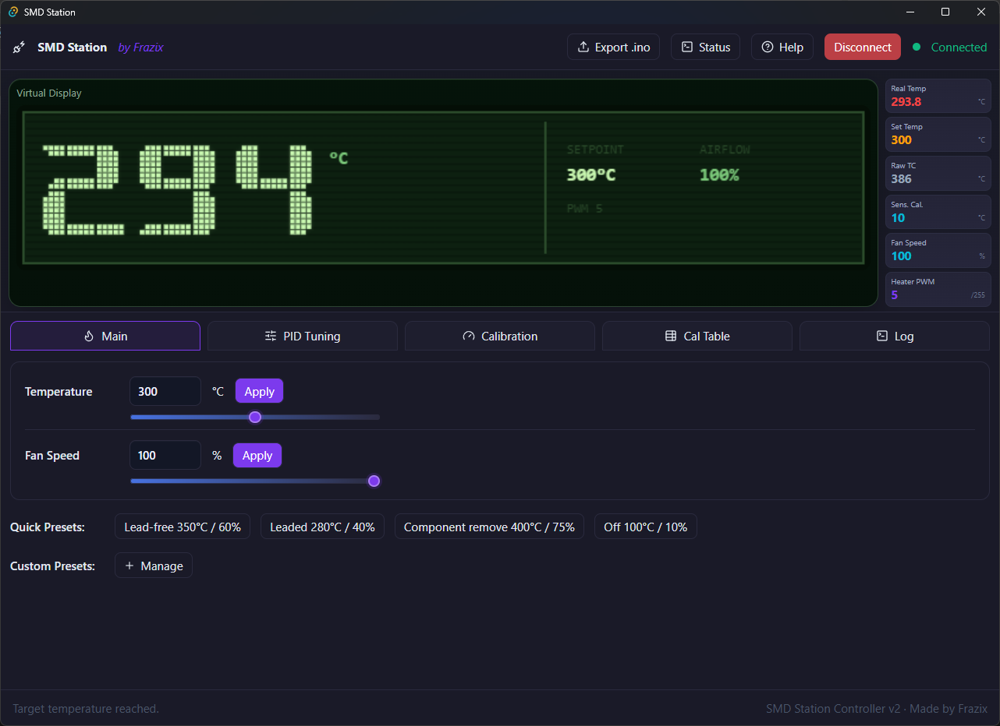
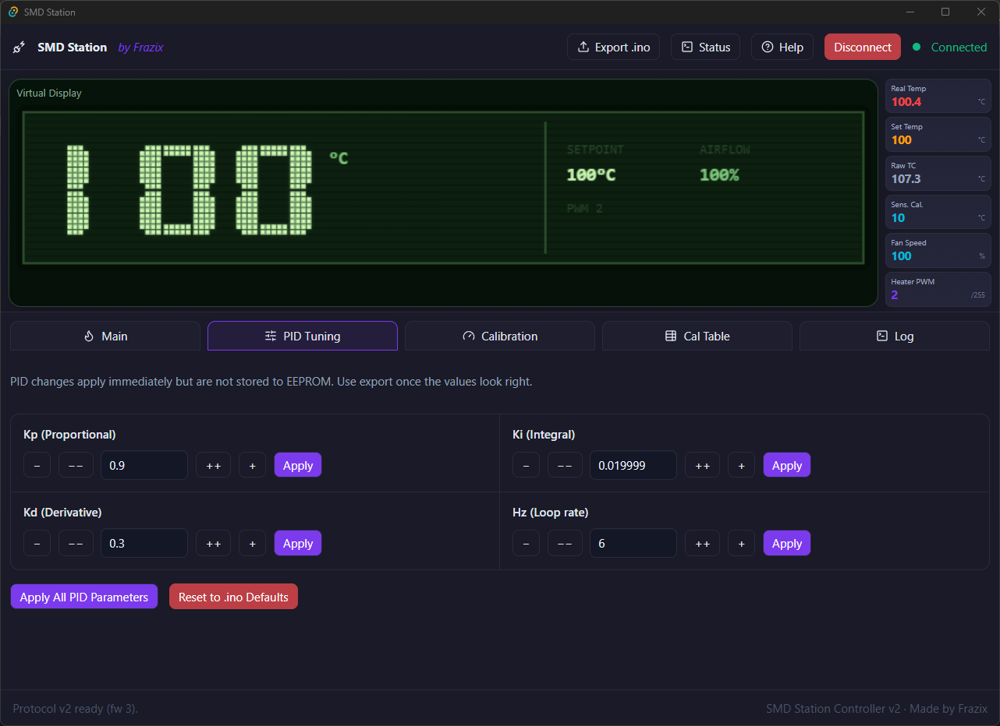
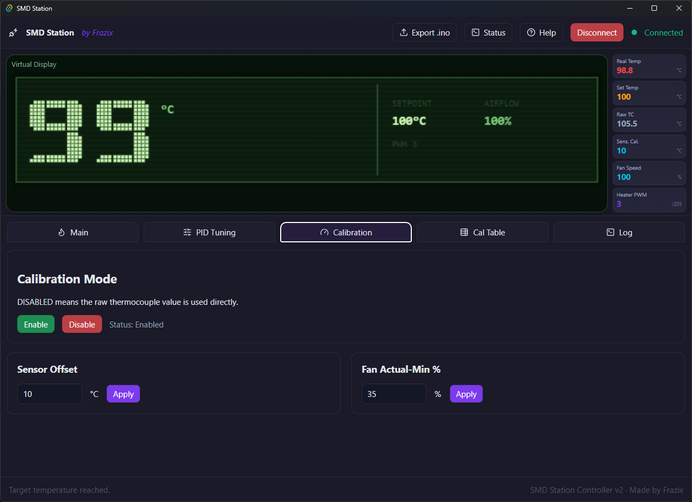
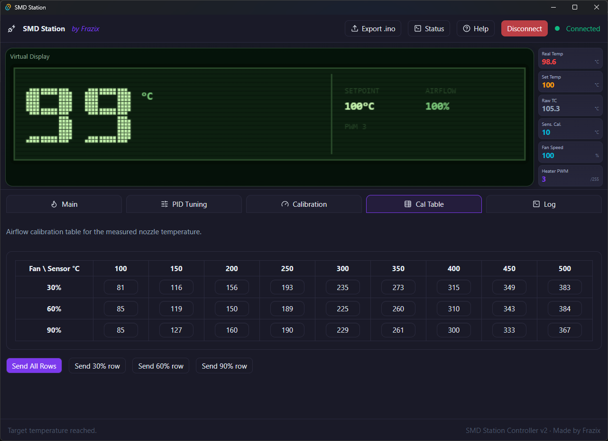

<div align="center">

# 🔧 SMD Rework Station

**Arduino-powered hot air rework station with PID control, desktop app & web UI**

<br/>

[](SMD.ino)
[](SMD.ino)
[](https://arduino.cc)
[](LICENSE)

[](https://github.com/Frazix12/SMD-Rework-Station/releases)
[](https://smd-station.vercel.app/)

</div>

---

## 🖥️ App Screenshots

<div align="center">

| 🔥 Main Control | ⚙️ PID Tuning |
|:---:|:---:|
|  |  |
| **🎯 Calibration** | **📊 Cal Table** |
|  |  |

</div>

---

## ✨ Features

<div align="center">

| | Feature | | Feature |
|:---:|:---|:---:|:---|
| 🌡️ | PID heater control via SSR output | 💨 | PWM fan control with calibrated airflow table |
| 🔌 | MAX6675 thermocouple input | 📟 | 16×2 I2C LCD with big temperature digits |
| 🔘 | 3-button interface — temp, airflow & calibration | 😴 | Sleep mode with fan cooldown protection |
| 🔔 | Buzzer feedback for events & transitions | 💾 | EEPROM persistence for all settings |
| 🖥️ | Serial protocol v2 for desktop/web companion app | 🌐 | Live web UI via [smd-station.vercel.app](https://smd-station.vercel.app/) |

</div>

---

## ⚡ Quick Start

> [!NOTE]
> Requires [`arduino-cli`](https://arduino.github.io/arduino-cli/) installed on Linux.

```bash
# 1. Set your board (once)
./flash.sh --set-board

# 2. Compile & upload
./flash.sh
```

<details>
<summary>📋 More flash options</summary>

```bash
./flash.sh --compile-only          # just compile
./flash.sh --upload-only           # just upload
./flash.sh -p /dev/ttyUSB0         # specify port
./flash.sh -b                      # open serial monitor
```

Board/port config is saved at `~/.config/smd-flash/config`.

</details>

---

## 🗺️ Hardware Pin Map

| Function | Pin | Notes |
|:---|:---:|:---|
| MAX6675 SO | `D12` | Thermocouple data |
| MAX6675 CS | `D10` | Chip select |
| MAX6675 SCK | `D13` | Clock |
| Heater SSR | `D9` | PID output |
| Fan PWM | `D3` | Fan drive |
| Buzzer | `D2` | Audio feedback |
| Sleep Input | `D4` | Active LOW |
| Up Button | `D5` | Active LOW + pull-up |
| OK Button | `D6` | Active LOW + pull-up |
| Down Button | `D7` | Active LOW + pull-up |
| LCD I2C | `A4` / `A5` | SDA / SCL |

---

## 🎮 Controls

| Button | Action |
|:---|:---|
| `UP` / `DOWN` | Adjust temperature setpoint or fan speed |
| `OK` | Toggle between temperature & fan adjustment |
| `Hold UP + DOWN` ~2s | Enter calibration mode |
| `Sleep pin LOW` | Stop heating, run fan cooldown |

---

## 🔌 Serial Protocol v2

The firmware speaks machine-readable packets and plain-text commands at **`115200`** baud.

**Packet types:** &nbsp;`@BOOT` &nbsp;·&nbsp; `@STATE` &nbsp;·&nbsp; `@EVENT` &nbsp;·&nbsp; `@ACK` &nbsp;·&nbsp; `@ERR`

| Command | Description |
|:---|:---|
| `SET <val>` | Set target temperature |
| `FAN <val>` | Set fan display % |
| `FANMIN <val>` | Set actual minimum fan % |
| `OFFSET <val>` | Set thermocouple offset |
| `KP / KI / KD <val>` | PID tuning gains |
| `HZ <val>` | PID update rate |
| `CALEN / CALDIS` | Airflow calibration on / off |
| `CALROW <f> <t> <v>` | Write one calibration table cell |
| `STATUS / INFO / HELP` | Diagnostics & help |

---

## 🌬️ Calibration

Use the [**Desktop App**](https://github.com/Frazix12/SMD-Rework-Station/releases) or [**Web App**](https://smd-station.vercel.app/) for easy point-and-click calibration.

<details>
<summary>📐 Manual calibration reference</summary>

<br/>

**Fan levels:** &nbsp;`30%` &nbsp;·&nbsp; `60%` &nbsp;·&nbsp; `90%`

**Temperature points:** `100 °C` through `500 °C` in 50 °C steps

Calibration data lives in `data.txt`. Apply changes via serial `CALROW` commands for live tuning, then **Export .ino** from the desktop app to persist them.

</details>

---

## 📁 Project Files

| File | Purpose |
|:---|:---|
| `SMD.ino` | 🔧 Main full-featured firmware |
| `flash.sh` | 🚀 Linux compile/upload helper |
| `data.txt` | 📊 Airflow calibration reference |

---

## ⚙️ Runtime Limits

| Setting | Value |
|:---|:---:|
| Temperature range | `100 °C – 500 °C` |
| Fan range | `10 % – 100 %` |
| Default fan minimum | `30 %` |
| Telemetry rate | `4 Hz` |

---

<div align="center">

Made with ❤️ and a soldering iron by **Frazix** & **E&E**

</div>
