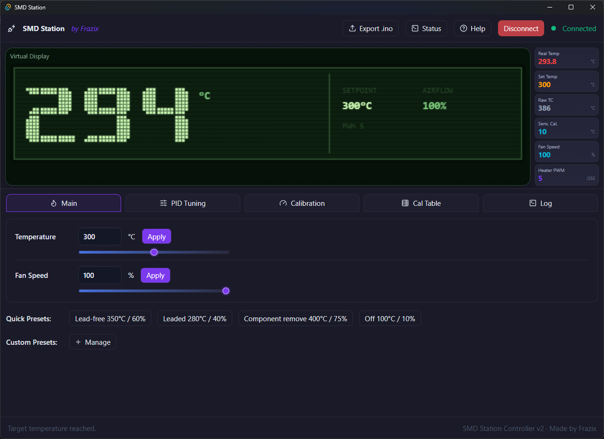
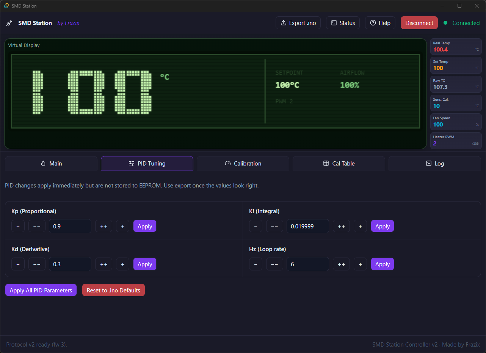
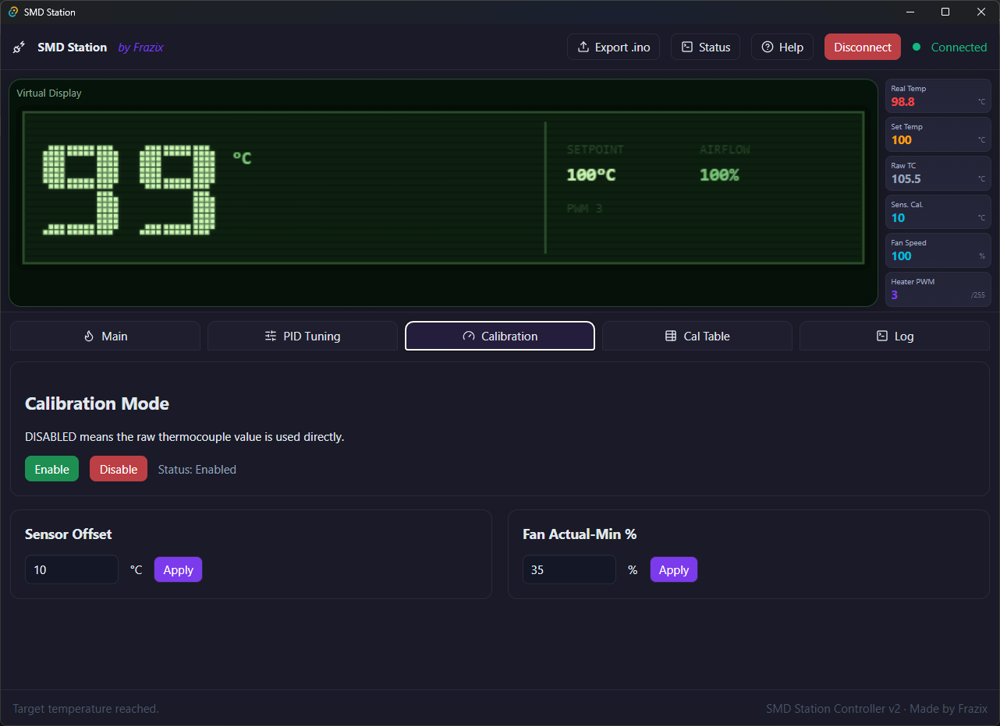
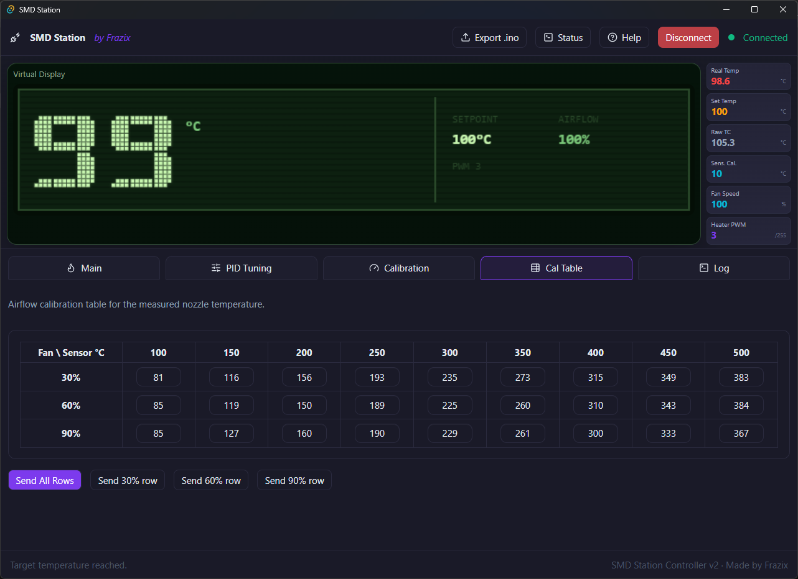
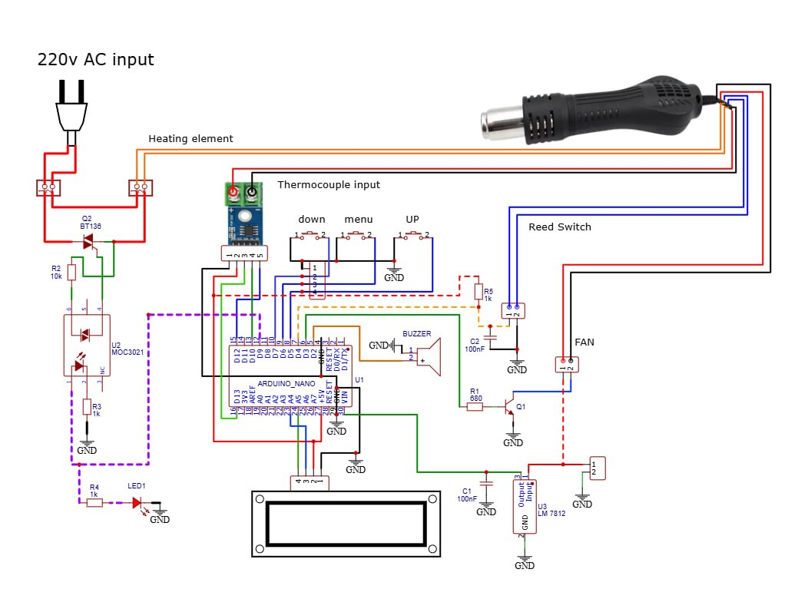

# 🔧 SMD Rework Station

**Arduino-powered hot air rework station with PID control, desktop app & web UI**

 

## ✨ Features

| | Feature | | Feature |
|:---:|:---|:---:|:---|
| 🌡️ | PID heater control via SSR output | 💨 | PWM fan control with calibrated airflow table |
| 🔌 | MAX6675 thermocouple input | 📟 | 16×2 I2C LCD with big temperature digits |
| 🔘 | 3-button interface — temp, airflow & calibration | 😴 | Sleep mode with fan cooldown protection |
| 🔔 | Buzzer feedback for events & transitions | 💾 | EEPROM persistence for all settings |
| 🖥️ | Serial protocol v2 for desktop/web companion app | 🌐 | Live web UI via [smd-station.vercel.app](https://smd-station.vercel.app/) |

---

## 🗺️ Hardware Pin Map

| Function | Pin | Notes |
|:---|:---:|:---|
| MAX6675 SO | `D12` | Thermocouple data |
| MAX6675 CS | `D10` | Chip select |
| MAX6675 SCK | `D13` | Clock |
| Heater SSR | `D9` | PID output |
| Fan PWM | `D3` | Fan drive |
| Buzzer | `D2` | Audio feedback |
| Sleep Input | `D4` | Active LOW |
| Up Button | `D5` | Active LOW + pull-up |
| OK Button | `D6` | Active LOW + pull-up |
| Down Button | `D7` | Active LOW + pull-up |
| LCD I2C | `A4` / `A5` | SDA / SCL |

---

## 🎮 Controls

| Button | Action |
|:---|:---|
| `UP` / `DOWN` | Adjust temperature setpoint or fan speed |
| `OK` | Toggle between temperature & fan adjustment |
| `Hold UP + DOWN` ~2s | Enter calibration mode |
| `Sleep pin LOW` | Stop heating, run fan cooldown |

---

## 🌬️ Calibration

Use the [**Desktop App**](https://github.com/Frazix12/SMD-Rework-Station/releases) or [**Web App**](https://smd-station.vercel.app/) for easy point-and-click calibration.

📐 Manual calibration reference

 

**Fan levels:** &nbsp;`30%` &nbsp;·&nbsp; `60%` &nbsp;·&nbsp; `90%`

**Temperature points:** `100 °C` through `500 °C` in 50 °C steps

Calibration data lives in `data.txt`. Apply changes via serial `CALROW` commands for live tuning, then **Export .ino** from the desktop app to persist them.

---

## 🖥️ App Screenshots

| 🔥 Main Control | ⚙️ PID Tuning |
|:---:|:---:|
|  |  |
| **🎯 Calibration** | **📊 Cal Table** |
|  |  |

---

## 🧩 Hardware Files

| Circuit Schematic | Components Needed |
|:---:|:---:|
|  | **1.** Arduino Nano (1) **2.** MAX6675 (1) **3.** MOC3021 (1) **4.** 10k resistor (1) **5.** 1k resistor (3) **6.** 680 ohm resistor (1) **7.** BT137 Triac (1) **8.** 104 capacitor (2) **9.** 13009 transistor (1) **10.** LM7812 regulator (1) **11.** Buzzer (1) **12.** LED (1) **13.** 2-pin terminal (2) **14.** Headers |

**Manufacturing files:**

| File | Purpose |
|:---|:---|
| [`Manufacture/Gerber.zip`](Manufacture/Gerber.zip) | PCB fabrication Gerbers |
| [`Manufacture/Top_Silk_Layer.pdf`](Manufacture/Top_Silk_Layer.pdf) | Top silk layer |
| [`Manufacture/Bottom_Silk_Layer.pdf`](Manufacture/Bottom_Silk_Layer.pdf) | Bottom silk layer |
| [`Manufacture/Button/Button_Gerber.zip`](Manufacture/Button/Button_Gerber.zip) | Button PCB fabrication Gerbers |
| [`Manufacture/Button/Button_Top_Silk_Layer.pdf`](Manufacture/Button/Button_Top_Silk_Layer.pdf) | Button top silk layer |
| [`Manufacture/Button/Button_Bottom_Silk_Layer.pdf`](Manufacture/Button/Button_Bottom_Silk_Layer.pdf) | Button bottom silk layer |

---

## 📁 Project Files

| File | Purpose |
|:---|:---|
| `SMD.ino` | 🔧 Main full-featured firmware |
| `flash.sh` | 🚀 Linux compile/upload helper |
| `data.txt` | 📊 Airflow calibration reference |

---

## ⚙️ Runtime Limits

| Setting | Value |
|:---|:---:|
| Temperature range | `100 °C – 500 °C` |
| Fan range | `10 % – 100 %` |
| Default fan minimum | `30 %` |
| Telemetry rate | `4 Hz` |

---

Made with ❤️ and a soldering iron by **Frazix** & **E&E**

---

**License:** [CC BY-NC-ND 4.0](LICENSE) — Personal use only, no commercial use or modifications allowed.

